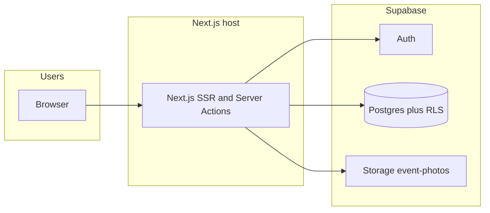

# Architecture & system overview

**Documentation only** — this file does not change application behavior. It describes how the HOSA Service Tracker is built, hosted, and secured. For setup steps see [README.md](./README.md); for schema see [supabase/migrations/](./supabase/migrations/).

---

## 1. Product summary

A **chapter HOSA service-hours tracker**: members log events (optional photos), submissions stay **pending** until **admins** approve or reject them; **approved** hours roll into totals and a **printable tracker** (browser Print → PDF). **Students** cannot delete events; a **24-hour edit window** applies to their own **pending** events (enforced in the UI and in Postgres RLS).

---

## 2. Hosting & deployment

| Layer | Technology | Notes |
|--------|------------|--------|
| **Web app** | Next.js 16 (App Router) on Node | Often deployed on **Render** or **Vercel** (or any Node host). `npm run build` → `npm run start`. |
| **Data & auth** | **Supabase** (managed) | Postgres + Auth + Storage. Separate from the Next.js host. |
| **Environment** | Host + `.env.local` | Required: `NEXT_PUBLIC_SUPABASE_URL`, `NEXT_PUBLIC_SUPABASE_ANON_KEY`. Optional chapter copy: [.env.local.example](./.env.local.example), [src/lib/chapterConfig.ts](./src/lib/chapterConfig.ts). |

Custom domains are configured on the **host** and in **Supabase Auth** (Site URL + redirect URLs).

---

## 3. Frontend stack

| Piece | Role |
|--------|------|
| **Framework** | Next.js 16, React 19, TypeScript ([package.json](./package.json)) |
| **Styling** | Tailwind CSS v4 — [src/app/globals.css](./src/app/globals.css) (`@theme`, surfaces, MRHS-style brand colors) |
| **Data** | `@supabase/supabase-js`, `@supabase/ssr` |
| **Icons** | `lucide-react` |
| **Images** | `next/image` — [next.config.ts](./next.config.ts) `remotePatterns` for Supabase Storage public URLs |

Scripts: `dev`, `build`, `start`, `lint`.

---

## 4. Routes & pages

| Path | Description |
|------|-------------|
| `/` | Redirect: signed in → `/dashboard`, else → `/login` — [src/app/page.tsx](./src/app/page.tsx) |
| `/login`, `/signup` | Email/password — [MrhsAuthShell](./src/components/auth/MrhsAuthShell.tsx), [chapterConfig](./src/lib/chapterConfig.ts) |
| `/dashboard` | Student tracker — [dashboard/page.tsx](./src/app/(app)/dashboard/page.tsx) |
| `/dashboard/add` | New event — [AddEventForm](./src/app/(app)/dashboard/add/AddEventForm.tsx), [EventFormPageShell](./src/components/forms/EventFormPageShell.tsx) |
| `/dashboard/edit/[id]` | Edit own event if allowed — [canEdit](./src/lib/types.ts) in [types](./src/lib/types.ts) |
| `/export` | Print / PDF flow — [export/page.tsx](./src/app/(app)/export/page.tsx), [Tracker](./src/components/tracker/Tracker.tsx) `printMode`; admins may use `?user=` |
| `/admin` | Pending queue, bulk approve — [admin/page.tsx](./src/app/(app)/admin/page.tsx), [PendingQueueClient](./src/components/admin/PendingQueueClient.tsx) |
| `/admin/all` | All events |
| `/admin/members` | Roster |
| `/admin/members/[id]` | Member controls + tracker — [MemberControls](./src/app/(app)/admin/members/[id]/MemberControls.tsx) |

**Layouts:** [src/app/layout.tsx](./src/app/layout.tsx) (root); [src/app/(app)/layout.tsx](./src/app/(app)/layout.tsx) (auth shell, [TopNav](./src/components/TopNav.tsx), [ensureProfile](./src/lib/ensureProfile.ts)).

---

## 5. Session & route protection

[src/lib/supabase/middleware.ts](./src/lib/supabase/middleware.ts) — `updateSession`:

1. Supabase server client from **cookies**, `getUser()`.
2. No user + not a public route (`/`, `/login`, `/signup`) → redirect ** `/login`** with `next=`.
3. User on `/login` or `/signup` → redirect **`/dashboard`**.

[src/proxy.ts](./src/proxy.ts) invokes `updateSession` (Next.js proxy integration).

---

## 6. Supabase clients

| File | Use |
|------|-----|
| [src/lib/supabase/client.ts](./src/lib/supabase/client.ts) | Browser |
| [src/lib/supabase/server.ts](./src/lib/supabase/server.ts) | Server Components & Server Actions |
| [src/lib/supabase/middleware.ts](./src/lib/supabase/middleware.ts) | Cookie refresh + redirects |

Only the **anon** key is used in the app; **RLS** applies. No **service role** in application code.

---

## 7. Server Actions

**[src/app/actions/events.ts](./src/app/actions/events.ts)** — `requireAdmin()` then: `approveEventAction`, `bulkApproveEventIdsAction`, `rejectEventAction`, `reopenEventAction`, `deleteEventAction` (removes storage when `photo_path` set), `updateProfileAction`. Uses `revalidatePath`.

**[src/app/actions/auth.ts](./src/app/actions/auth.ts)** — `signOutAction`.

---

## 8. Shared libraries

| Path | Role |
|------|------|
| [src/lib/types.ts](./src/lib/types.ts) | Types, `canEdit`, formatters, duration helpers |
| [src/lib/chapterConfig.ts](./src/lib/chapterConfig.ts) | Chapter copy & env overrides |
| [src/lib/mrhsBranding.ts](./src/lib/mrhsBranding.ts) | Chapter name parsing |
| [src/lib/eventQueries.ts](./src/lib/eventQueries.ts) | PostgREST select with approver join |
| [src/lib/signupErrors.ts](./src/lib/signupErrors.ts) | Signup email / error helpers |
| [src/lib/ensureProfile.ts](./src/lib/ensureProfile.ts) | Ensures `profiles` row exists |
| [src/lib/compressImage.ts](./src/lib/compressImage.ts) | Client image compression before upload |

---

## 9. Database (Supabase Postgres)

### Tables (conceptual)

- **`admin_emails`** — emails eligible for admin (see triggers / `email_is_admin`).
- **`profiles`** — one row per `auth.users.id`.
- **`events`** — service log rows; `status`, approval metadata, optional photos.
- **`signup_allowed_domains`** — optional allowlist ([0005](./supabase/migrations/0005_signup_security.sql)).

### Storage

- Bucket **`event-photos`** — public read; write/delete policies per migrations.

### Migrations (run order)

1. [0001_init.sql](./supabase/migrations/0001_init.sql) — core schema, RLS, storage, triggers.
2. [0002_profile_bootstrap.sql](./supabase/migrations/0002_profile_bootstrap.sql) — patches for older installs.
3. [0003_profiles_insert_use_auth_users_email.sql](./supabase/migrations/0003_profiles_insert_use_auth_users_email.sql) — `auth_session_email` + policy.
4. [0004_events_hours_precision.sql](./supabase/migrations/0004_events_hours_precision.sql) — hours precision.
5. [0005_signup_security.sql](./supabase/migrations/0005_signup_security.sql) — domain gate, admin after email confirm, auth sync.

### RLS (summary)

Profiles, events, and `admin_emails` policies are defined in `0001` and follow-up migrations: students scoped to own data; admins broader access; deletes admin-only for events.

---

## 10. Security model (short)

- **Auth:** Supabase (JWT via cookies).
- **Authz:** `profiles.is_admin` + **RLS** on all anon-key access.
- **Admin list:** SQL `admin_emails`; not editable by students via RLS.

---

## 11. System diagram

---

## 12. Out of scope for this repo

Host YAML, Supabase dashboard toggles (e.g. Confirm email), Edge Functions, service role usage, automated test suite.

---

## 13. Exporting as PDF for advisors

Open this file in a Markdown preview or editor, then **Print → Save as PDF**, or paste into Docs/Notion and export.
